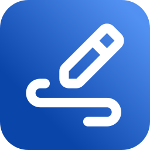

  
  <h1 align="center">Drawy</h1>
  
Your handy, infinite, brainstorming tool!

Drawy is a work-in-progress infinite whiteboard tool written in Qt/C++, which aims to be a native-desktop alternative to the amazing web-based Excalidraw.

# Community

Join our Discord server to engage with our community and help shape the future of Drawy!

# Installation

## Compiling from Source

- Install `cmake` and `g++`
- Install Qt 6.9 or above from [here](https://www.qt.io/download-qt-installer-oss) or using [aqtinstall](https://github.com/miurahr/aqtinstall)
- Clone this repository: `git clone https://github.com/prayag2/drawy && cd drawy`
- Setup cmake: `cmake -B build -S . -DCMAKE_BUILD_TYPE=Release`
- Compile: `cmake --build build --config Release`
- Run: `./build/drawy`

# Keyboard Shortcuts

> [!NOTE]
> Future releases will allow you to change the keyboard shortcuts.

| Key Combination                                                                   | Description                |
|:---------------------------------------------------------------------------------:|:--------------------------:|
| <kbd>Ctrl</kbd> + <kbd>Z</kbd>                                                    | Undo                       |
| <kbd>Ctrl</kbd> + <kbd>Y</kbd>, <kbd>Ctrl</kbd> + <kbd>Shift</kbd> + <kbd>Z</kbd> | Redo                       |
| <kbd>Ctrl</kbd> + <kbd>+</kbd>                                                    | Zoom In                    |
| <kbd>Ctrl</kbd> + <kbd>-</kbd>                                                    | Zoom Out                   |
| <kbd>Ctrl</kbd> + <kbd>G</kbd>                                                    | Group selection            |
| <kbd>Ctrl</kbd> + <kbd>Shift</kbd> + <kbd>G</kbd>                                 | Ungroup selection          |
| <kbd>P</kbd>, <kbd>B</kbd>                                                        | Freeform Tool              |
| <kbd>E</kbd>                                                                      | Eraser Tool                |
| <kbd>S</kbd>                                                                      | Selection Tool             |
| <kbd>R</kbd>                                                                      | Rectangle Tool             |
| <kbd>O</kbd>                                                                      | Ellipse Tool               |
| <kbd>L</kbd>                                                                      | Line Tool                  |
| <kbd>A</kbd>                                                                      | Arrow Tool                 |
| <kbd>M</kbd>                                                                      | Move Tool                  |
| <kbd>T</kbd>                                                                      | Text Tool                  |
| <kbd>Ctrl+A</kbd>                                                                 | Select All                 |
| <kbd>Delete</kbd>                                                                 | Delete selection           |
| <kbd>Ctrl+S</kbd>                                                                 | Save                       |
| <kbd>Ctrl+O</kbd>                                                                 | Open File                  |
| <kbd>Right Click</kbd> (Hold)                                                     | Eraser Tool                |
| <kbd>Space</kbd> + <kbd>Left Click</kbd>                                          | Move Tool                   |

# Contributing

Contributions are welcome. Please read the [Contributing Guide](CONTRIBUTING.md) before opening pull requests.

# License

This project uses the GNU General Public License V3.

# Support Me ♥

If you liked this project, then please consider supporting me!

# TODOs

Started: `2025-01-02 04:40PM`
Development is divided into phases.
The project will eventually be open sourced. However, I will work on the first few phases myself, to maximize learning.
The following is a list of features I'll be planning to add to it:

## Phase 1 (Basic Features)

- [x] A simple fixed size canvas to draw on using a black coloured stroke.
- [x] Different shapes like rectangle, ellipse, arrow, line and stroke.
- [x] An eraser to erase the strokes (deleting the strokes).
- [x] Testing.

## Phase 2

- [x] Refactor to try to adhere to SOLID principles and utilize useful design patterns
- [x] A custom Qt layout for toolbar and properties bar
- [x] Make canvas infinite and add ability to move the viewport
- [x] Use an LRU cache based uniform grid to optimize moving the canvas around (now 100% faster!!)
- [x] A properties bar to change the following properties:
    - [x] Colour of strokes
    - [x] Stroke width

## Phase 3

- [x] Buttons to zoom in/out
- [x] Pressure senstivity for drawing tablets
- [x] Selection tool to select items and do these actions:
    - [x] Move items
    - [x] Delete items
    - [ ] Transform items (resize) (Low priority)
    - [ ] Rotate items (Low priority)
- [x] Undo/redo support
- [x] Basic keybinding support
- [x] Saving the drawings
- [x] Text support
- [ ] Exporting drawings to PNGs
- [ ] Image support
- [ ] Text formatting like bold, underline, italics, etc.
- [ ] Better freeform smoothing algorithms
- [ ] Allow snapping
- [ ] Ability to store preferences
- [ ] A "settings" page
- [ ] Better widgets
- [ ] Online collaboration

Feature requests are welcome!
